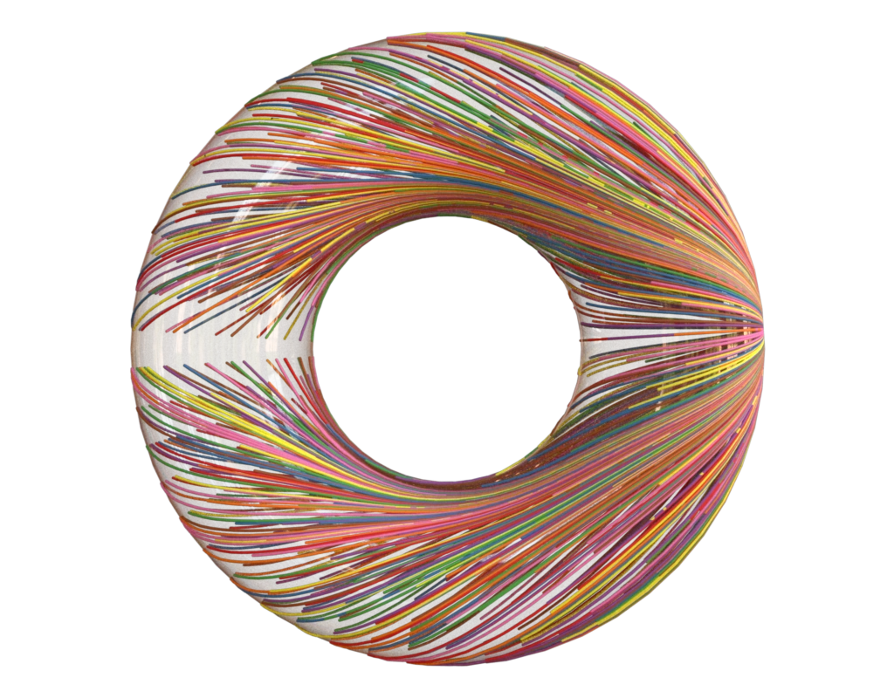

# Geodesics

Compute shortest paths from a point on a torus to 1,000 blue-noise samples. Each connected path is colored separately and displayed over the dielectric torus.



[Interactive WebGL demo](results/geodesics.html)

## Method

`generate_data.py` creates a triangulated torus, samples target points, and uses Lagrange's `GeodesicEngineFlip` to compute the paths. `geodesics.py` renders the curve mesh and computes connected-component IDs for categorical path colors.

Regenerate the mesh inputs and both renders with:

```sh
python generate_data.py
python geodesics.py
```

## Input contract

- `torus`: surface from `data/donut.obj`; no pre-existing attributes required.
- `paths`: curve from `data/geodesics.obj`; no pre-existing attributes required.

## Reproduce and inspect

```sh
python ../render_gallery.py --check Geodesics
python ../render_gallery.py --artifacts Geodesics
```

[Python](geodesics.py) · [Manifest](recipe.toml) · [Inspection](artifacts/inspect.json) · [Canonical JSON](artifacts/figure.json) · [Validation](artifacts/validation.json)
