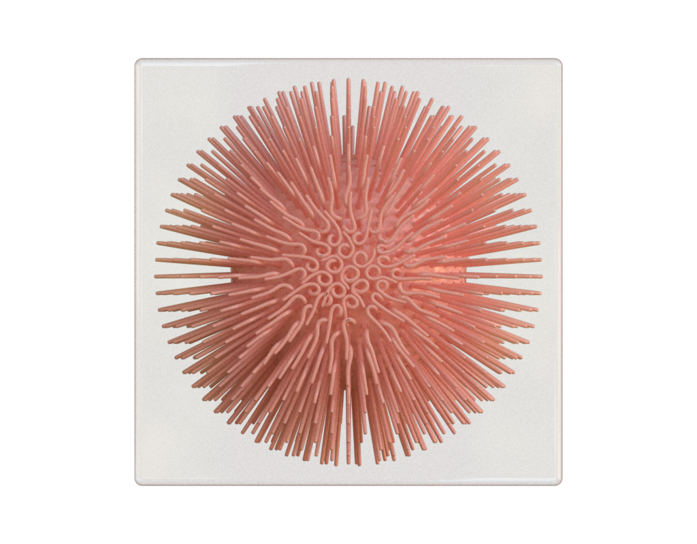

# Incremental Potential Contact

This example aims to reproduce [Figure 22](https://ipc-sim.github.io/file/IPC-squishyBall.jpg) from
the paper "[Incremental Potential Contact: Intersection- and Inversion-free Large Deformation
Dynamics](https://ipc-sim.github.io/)".




## Data

The data were generated by compiling and running the IPC code:

```sh
./IPC_bin -o out 100 ../input/paperExamples/22_squishyBall.txt out
```
